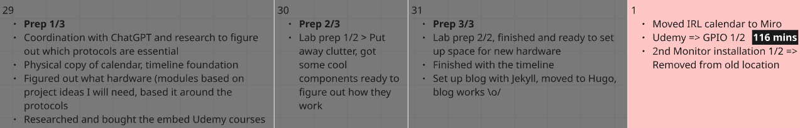

+++
title = "GPIO1   Pull Up My Pants, This Not Easy"
date = "2025-06-01T22:50:54+02:00"
#dateFormat = "2006-01-02" # This value can be configured for per-post date formatting
author = ""
authorTwitter = "" #do not include @
cover = ""
tags = ["", ""]
keywords = ["", ""]
description = ""
showFullContent = false
readingTime = false
hideComments = false
+++

# **GPIO 1/3**

---

## **Introduction**

The work begins with the fundamentals of GPIO.\
Turns out, I will be exploring electronics concepts rather frequently.\
I know! I was kind of shocked myself that electronic devices work by the principles of electricity!

I've been taking notes, which I would like to refer to later on during the creation of my project based around the protocol.\
Oh, did I mention?\
I plan on creating a project for each of the protocols I explore so that I create value with the knowledge I obtain.

I feel that I may have underestimated how much time I am spending on learning; hence, the day quickly ended before I blinked twice.\
It was to be expected, and I am prepared to keep adjusting the course of my journey, you cannot expect to have perfect first results anyway!

With gratitude, I dedicate this as a shoutout to the following Discord communities, for they let me advertise my blog and the journey I am on:

- YRAC (Young Amateurs Radio Club)
- Embedded Engineering
- 8 Bit World
- HSBP
- Usagi Electric
- OffGridEnclave

Thank you for those who choose to be patient with me (and also others) during my journey, and the ones who take the time to help me better understand concepts. You make a huge difference in our community, and that's nothing short of amazing!

I've got some feedback already, and I will implement an RSS feed soon on the layout soon!

Some other feedback arrived stating that learning is best done by practicing.\
To cement this idea, I will come up with the projects tomorrow, first thing in the morning, and get to work building something cool! \o/

As it is my first blog, I feel unsure about the style I want to go for, but it is without a doubt to spread knowledge; hence, you can read the notes I took today\
Terms highlighted in bold are the most important keywords to remember.

(Disclaimer: My notes can potentially have errors in them; I recommend not using them as reference material, but more so as a light read!)

Also!\
I plan on doing a lab tour soon!\
I mean, come on!\
That was to be expected from an electronics nerd!!!

## **Work on a 2nd monitor, finally!**

While I am grateful for the monitor I am creating this post from, as a developer, it quickly gets tiresome to constantly ALT+TAB from a source of information.\
To fix this issue, I am taking advantage of my dad's old display, which I will be installing tomorrow. (Removal alone was a piece of work!)

Uh, there is now a gaping hole in the other room, but let now move on to me being a liar, and why exactly I chose to lie!

## **A white lie**

My plans actually began on May 29th, and I wanted to share what I've been doing the past few days, too.\
I hope you can forgive me! ;)



---

# **Notes**

Pin implementation => 2 Buffers (I/O):\
A buffer consists of 2 CMOS transistors (Respectively PMOS and NMOS)\
**Enable Line** => Configured by GPIO control registers\
**Buffer** pin => **Inverter** => **Output pin** => 101 or 010 => **"Whats on the I/O buffer originally will be on the I/O pin"**\
**Input buffer** => Invert the **Output buffer** vertically

### **Input mode => High Impedance / HI-Z state**

**Floating state** => The pin is floating because the input is unfixed\
After powering on most MCU's by default all GPIO pins are **Input mode with HI-Z**\
Keeping the pin in floating state can lead to higher power consumption as it becomes susceptible to picking up circuit voltage noise we call this **Leakage Current**\
The value of leakage is defined by the **Indeterminate Region** of the voltage

### **Input mode => Pull-up/down states**

The floating state is avoided by introducing internal resistors\
Internal resistor **Pull-up state** => Rᵢ is active\
Internal resistor **Pull-down state** => Rₑ is active\
Internal resistors are configured in the GPIO port's registers\
The value of internal resistors are fixed (10kΩ - 50kΩ) and exact values are found in the reference manual of the MCU\
Its always safe to keep unused GPIO pins in one of the states so we avoid leaking current

### **Output mode => Open-drain**

Open drain output is when we remove T1 (PMOS) from the buffer\
On its own it can only pull down => Its either GND or Floating\
We introduce a pull-up resistor to the floating state

### **Open drain with internal pull-up resistor**

Configure inside MCU GPIO registers\
Open drain with external pull-up resistor\
Add component externally by hand\
Driving an LED in open drain\
Activate internal resistor => Connect LED to pin

### **Example usage of Open drain**

I2C bus => SDA (Serial Data pin) and SCL (Serial Clock pin), they are both open drain configured\
To use the bus properly, we have to provide internal or external pull-up resistors for each pin\
The correct value of the resistors for the I2C bus depends on the total capacitance on the bus, the frequency at which the bus works. (Generally 4.7kΩ to 10kΩ works)\
Output mode => Push-pull configuration\
GPIO ports by default are input mode\
If we configure any pin as output mode, by default it will be push-pull configurated\
Its called push-pull because the output is pulled actively between 1 and 0 between T1 and T2 transistors

### **Driving an LED in push-pull configuration**

No pull-up resistor is needed, LED is connected through a current-limiting resistor

### **GPIO Programming Interace**

Each GPIO port is governed by many registers\

- **Direction / Mode register** => Set direction or mode as I/O, analog, etc.\
- **Input data register** => Read data from port\
- **Output data register** => Write to port\
  All GPIO registers are connected over a **system bus** to the CPU\
  Ports label ex.: GPIOA ~ GPIOI, but usually **GPIOx** where x

### **Ex.: For the STFM32F407**

- GPIO ports are connected over AHB1 to the CPU\
- **AHB1** => **Main system bus** which operates at max 168 MHz clock speed\
- 9 Ports => Each port has all of the registers as found in the MCU's datasheet

Register details are in the reference manual, not in the datasheet!\
Reference manual helps understanding various bit fields of the register\
These details are important, it gives us an idea how to control the peripheral\
The last sub-section is for the register map in the sections for registers => Offset address, base address, etc.

### **Ex.: STM32F407VG MCU**

**Register name**: GPIOx_MODER, where x = A~I\
**Address offset**: 0x00 => No offset\
**Reset values** \

- Port A => 0xA800 0000\
- Port B => Some other value\
- Other ports => 0x00...\

When the MCU undergoes a **System Reset**, **Power-on reset**, **Power-down reset** these are the default values afterwards\
Each GPIO port has 16 pins => Pin15-Pin0\

Each Pin has 2 bits assigned to it, which are responsible for configuring the pin's mode according to the table below:\

- 00 => Input (reset state)\
- 01 => General Purpose Output Mode\
- 10 => Alternate Function\
- 11 => Analog Mode => For analog signals (ADC/DAC)\
  Whenever the MCU is reset, all the pins of different GPIO ports are defaulted to Input state

Some pins on the MCU cannot be used for all purpose, while others may be => These we call pins but not GPIO pins
Ex.: Power pin on the MCU cannot be called a GPIO pin as we cannot set the modes of GPIO

### **Input Mode**

- The output driver is disabled
- TTL Schmitt trigger is enabled
- Whatever the I/O state the pin is in will be read to the input data register for every AHB1 clock cycle, and the register will be updated, where the firmware can read the value
- The pull-up/down resistors are disabled

### **Input Mode => Foating Input**

The output driver is disabled => Any random noise of the MCU of our board will affect the value we are reading into the input register
This open circuit has the potential to corrupt the data in our input data register, which means that whatever data we read from the I/O pin may not be correct!

Ex.:

```C
if (IO_pin == HIGH) {
    turnMotorOn();

    // Bug: IO_Pin will sometimes be 0 or 1 => The motor will not work properly
}
```

**Solution:**

- Activate the pull-up resistor => The I/O pin is not floating anymore as it is held at VDD
- There are now proper states for both HIGH and LOW

The value of the pull-up/down resistor can be found in the datasheet (ie.: I/O static characteristic)
Weak pull-up/down resistor => A resistor which allows very less current across it
